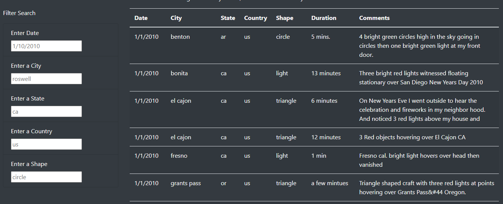
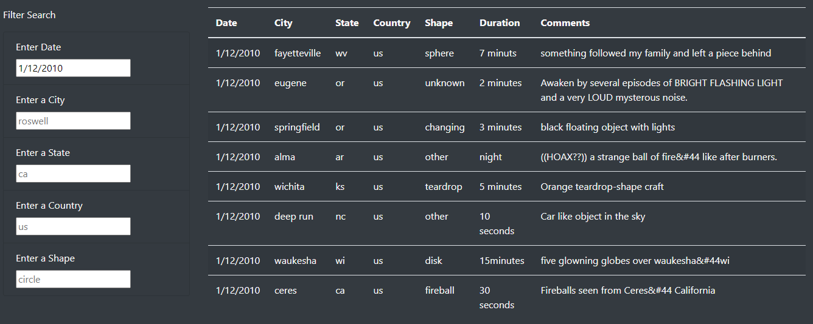
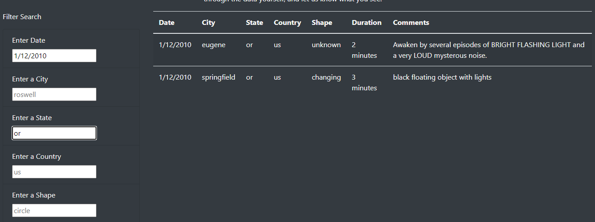

# UFOs
In this project, we used UFO Sighting data to build a dynamic, filterable table to be presented on the client's website.

## Overview
The data table on the original website was only able to be filtered by the date of the reported sighting. The client wanted a more dynamic filter that could be filtered on multiple different criteria. We decided to give users the option to filter the table based on date, city, state, country, and shape of the UFO. This makes it easier to search for sightings that are more relevant to each user.

## Results
Through the use of JavaScript, HTML, and CSS, we were able to create a website in which users can filter by multiple criteria. Users can enter any combination of date, city, state, country, and shape, press "Enter", and the filtered results will appear in the table. There is "placeholder" information in the filters in order to give users an example of how to enter their desired filters, but this "placeholder" information does not actually filter the table.

Here is an image of the unfiltered table and the placeholder information:
</img>

If a user wants to search for sightings on 1/12/2010, the user should enter "1/12/2010" into the date filter, and press enter. The table will appear as such:
</img>

If the user wants to look for sightings in a specific area, they add the city and/or state to the appropriate filter. Here, you can see an example of all sightings in Oregon on 1/12/2010:
</img>

## Summary
As seen above, the website and filters are successful. However, there is always room for improvement. Right now, the filters are case-specific. So, if I want to look for sightings in California, I must type "ca" to match the "state" column of the table exactly. This might lead to users assuming there are no results for their state, city, etc.

One suggestion for improvement would be to allow the functions to look for similar matches rather than only exact matches, so that the case of the user's input does not matter.

Another way that the functionality of the filtering could be improved would be to add another function to traverse the "comments" column of the table in order to find sightings with similar descriptions.